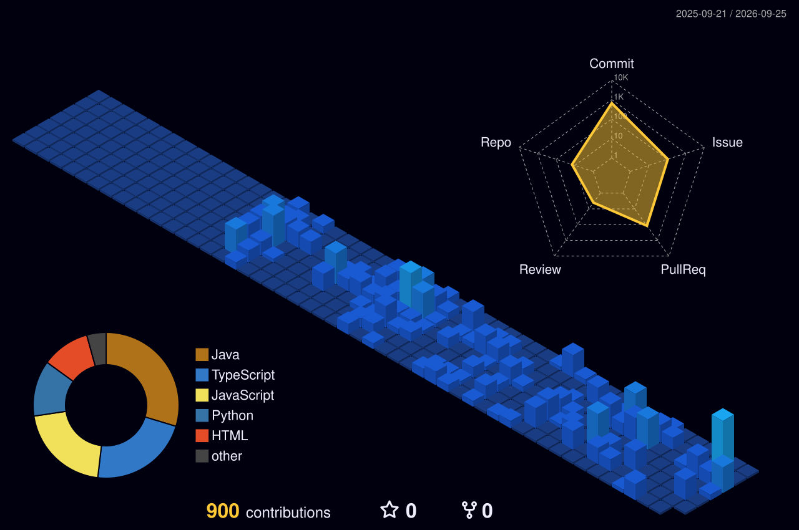

 

  

## ✨ Highlights

- 🥗 **[Slunch Factory](https://slunch.co.kr/)** 에서 자사몰 커머스 **VeggieVerse**를 초기 구축부터 1차 런칭까지 프론트엔드 전담 — **5개 레포 500+ 커밋** (2026.05 ~ 현재)
- 💳 **토스페이먼츠 빌링 기반 결제·구독 시스템** 구축 — 결제 순서 재설계 · 품절 하드 가드 · 타임존 버그 등 엣지케이스를 설계로 해결
- 🛡️ CI가 전무하던 프로덕트에 **typecheck·build·test 게이트, 번들 보안 검증, SEO 구조화** 등 런칭 품질 기준을 0에서 수립
- 🧑‍💻 인천대 **[앱센터](https://github.com/inu-appcenter)** [memorIN](https://github.com/inu-appcenter/memorIN) **백엔드 시니어** (Spring Boot · PostgreSQL · WebSocket) · 인천대 **인공지능빅데이터센터**에서 RAG · LLM Agent 연구

## 💼 Experience

### 🏢 Slunch Factory — 프론트엔드 인턴 2026.05 ~ 현재

> AI 기반 비건 식단 구독 푸드테크 스타트업. 자사몰 **[VeggieVerse](https://slunch.co.kr/)** B2C 커머스를 초기 구축부터 1차 런칭까지 전담했습니다. (사내 레포는 비공개 — 라이브 서비스와 [포트폴리오](https://doyoungkim-portfolio.vercel.app/)에서 확인하실 수 있어요)
>
> `Next.js` `React` `TypeScript` `Tailwind CSS` `TanStack Query` `Supabase` `Toss Payments`

**결제 · 구독 시스템**
- 토스페이먼츠 빌링키 기반 정기결제·결제수단 관리 구축 — 복수 카드 등록 · 기본 카드 지정 · 등록 카드 바로결제
- 신규 카드 사용자의 첫 구독 결제가 전부 400으로 실패하는 문제를 발견, 결제 흐름을 **'카드 등록 → 주문 생성 → 결제'** 순서로 재설계해 해결
- 품절 상품이 결제까지 진행되던 경로에 **재고 재조회 하드 가드** 적용 (조회 실패 시 오차단을 막는 fail-open 설계)
- 구독 시작일이 UTC 변환으로 하루 밀리던 타임존 버그, 화면마다 다르던 구독 상태 판정을 유틸 단일화로 해결

**1차 런칭 품질 (CI · 보안 · SEO · 성능)**
- CI가 없던 레포에 typecheck·build·test 차단 게이트 신설, vitest 도입 후 순수함수 테스트 40케이스 작성
- 백엔드 오리진이 클라이언트 번들에 노출된 것을 빌드 산출물 분석으로 발견 → same-origin 프록시로 재구성, **노출 11건 → 0건** · 오픈 SSRF 라우트 제거
- canonical 15페이지 명시 · sitemap 276 URL · Product/Recipe JSON-LD 등 SEO 기반 신설
- 레포에 커밋돼 있던 **정적 에셋 290MB**를 Supabase Storage 서빙으로 이관, next/image 전환 · 한/영 i18n 구축

**커머스 운영 도구 · B2B · 백엔드**
- 운영 관리자 화면 초기 구축부터 전담 — 상품 CRUD, 상세페이지 편집기 + Figma export HTML 파이프라인, 재고·출고(fulfillment) 관리
- 수출 B2B 사이트 — FOB 자동견적(실시간 환율 · 인코텀즈), 컨테이너 적재 시뮬레이션, **12로케일 i18n · 아랍어 RTL**
- 공장 HACCP 관리자 — 완제품 재고 · LOT · 출고 관리, 현장용 모바일 UI 전면 개편
- Spring 백엔드 FOB API 작업 — 인증 필터체인 분기(공개/인증/403) 설계와 보안 슬라이스 테스트 작성

### 🔬 인천대학교 인공지능빅데이터센터 — 학생연구원 2026.05 ~ 2027.01(예정)

- INU-챗봇 자율운영을 위한 Agent 개발 — 학칙·규정 문서 기반 **RAG 파이프라인** 구축, LLM 환각 억제를 위한 답변 검증 시스템 개발 참여
- 교내 INTIP 플랫폼 프론트엔드 · 챗봇 UI/UX 구현

## 📌 Featured Projects

| 프로젝트 | 설명 | 기술 |
|---------|------|------|
| 🥗 **VeggieVerse** · [🔗 Live](https://slunch.co.kr/) | 비건 식단 구독 자사몰(B2C 커머스). 결제·구독·마이페이지부터 관리자·B2B·공장 HACCP 화면까지 **5개 레포 500+ 커밋** 전담, 1차 런칭 (사내 비공개 레포) | Next.js · TypeScript · TanStack Query · Toss Payments |
| 💬 **[memorIN](https://github.com/inu-appcenter/memorIN)** | 일상 아카이빙 + 통합 메신저 소셜 서비스. **백엔드 시니어**로 온프레미스 저사양 서버 대상 API 설계 · 코드리뷰 · 성능 튜닝 | Spring Boot 3.5 · PostgreSQL 18 · MinIO · STOMP |
| 🌌 **[GitGalaxy](https://github.com/kimdoyoung1110/gitgalaxy)** · [🔗 Live](https://frontend-three-delta-41.vercel.app) | GitHub 저장소 **약 1,900개 · 10만+ 데이터 포인트**를 3D 우주로 실시간 시각화. Web Worker · InstancedMesh로 **60fps** 달성 | React · Three.js · R3F |
| 🧭 **[DevRoad](https://github.com/kimdoyoung1110/DevRoad)** | 채용 트렌드 · 모의 면접 서비스. 번들 최적화로 **TBT 72%↓**, 초기 페이로드 **99%↓** | Next.js · TypeScript · Recharts |
| 🤖 **[AppCenter AI Server](https://github.com/inu-appcenter/AppCenter-AI-Server)** | 앱센터 통합 AI 서버 — **RAG 기반 LLM 챗봇** 백엔드 API | Spring Boot · Python · RAG |
| 🛒 **[CartrAIder](https://github.com/CartrAIder)** | 스마트 AI 카트 고객용 모바일 앱 — 상품 인식 · 결제 흐름 | React Native · Expo · TypeScript |

> 🔎 프로젝트별 상세 성과는 **[포트폴리오 사이트](https://doyoungkim-portfolio.vercel.app/)** 에서 확인하실 수 있어요.

## 🛠️ Tech Stack

**Frontend**

**Backend & Mobile**

**DB & Infra**

 

## 📊 GitHub Stats

<picture>
  <source media="(prefers-color-scheme: dark)" srcset="https://raw.githubusercontent.com/kimdoyoung1110/kimdoyoung1110/output/github-snake-dark.svg"/>
  
</picture>

## 📝 Latest Posts

> Velog에 기록하는 개발 과정입니다. (매일 자동 갱신)

<!-- BLOG-POST-LIST:START -->- [N+1인 줄 알았는데 아니었다 — 영속성 컨텍스트](https://velog.io/@kdy9883/nplus1-persistence-context-first-level-cache) 2026.07.22
- [전화번호 텍스트 하나 때문에, Safari에서만 터지던 Hydration Error 36건 추적기](https://velog.io/@kdy9883/react-hydration-error-safari-format-detection) 2026.07.03
- [빈 화면을 없애려다 배운 것들 — 스켈레톤, shimmer, 그리고 React Query](https://velog.io/@kdy9883/skeleton-shimmer-react-query) 2026.06.25
- [DevRoad 프론트엔드 리팩토링](https://velog.io/@kdy9883/DevRoad-%ED%94%84%EB%A1%A0%ED%8A%B8%EC%97%94%EB%93%9C-%EB%A6%AC%ED%8C%A9%ED%86%A0%EB%A7%81) 2026.04.08
- [단순한 버전업이 아니다: 프론트엔드 개발자가 알아야 할 TypeScript 6.0의 큰 그림](https://velog.io/@kdy9883/typescript-6-big-picture) 2026.03.28
<!-- BLOG-POST-LIST:END -->

## 📫 Contact

  

