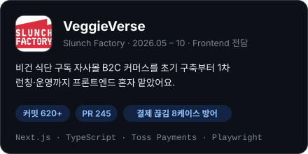
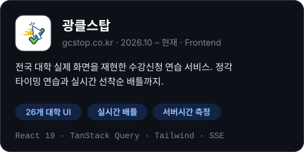
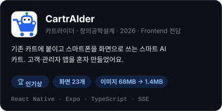
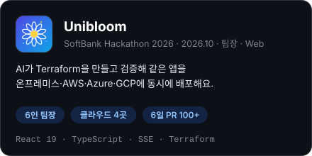
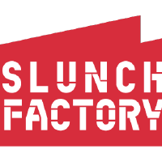
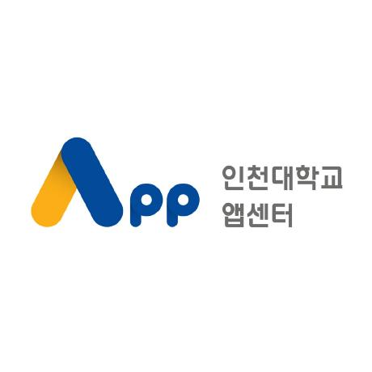
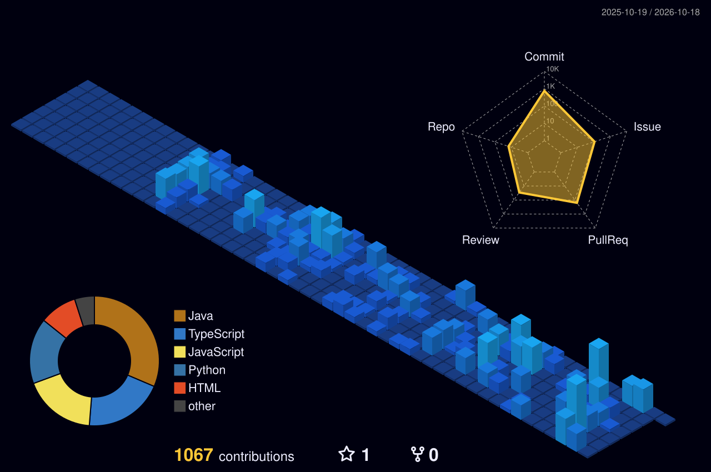

<picture>
  <source media="(prefers-color-scheme: dark)" srcset="assets/terminal-dark.svg"/>
  <source media="(prefers-color-scheme: light)" srcset="assets/terminal-light.svg"/>
  
</picture>

## 📌 Featured Projects

<a href="https://slunch.co.kr/"><picture>
  <source media="(prefers-color-scheme: dark)" srcset="assets/cards/veggieverse-dark.svg"/>
  <source media="(prefers-color-scheme: light)" srcset="assets/cards/veggieverse-light.svg"/>
  
</picture></a>
<a href="https://korea.time.com/"><picture>
  <source media="(prefers-color-scheme: dark)" srcset="assets/cards/timekorea-dark.svg"/>
  <source media="(prefers-color-scheme: light)" srcset="assets/cards/timekorea-light.svg"/>
  
</picture></a>

<a href="https://gcstop.co.kr"><picture>
  <source media="(prefers-color-scheme: dark)" srcset="assets/cards/gcstop-dark.svg"/>
  <source media="(prefers-color-scheme: light)" srcset="assets/cards/gcstop-light.svg"/>
  
</picture></a>
<a href="https://github.com/CartrAIder"><picture>
  <source media="(prefers-color-scheme: dark)" srcset="assets/cards/cartraider-dark.svg"/>
  <source media="(prefers-color-scheme: light)" srcset="assets/cards/cartraider-light.svg"/>
  
</picture></a>

<a href="https://www.unibloom.cloud"><picture>
  <source media="(prefers-color-scheme: dark)" srcset="assets/cards/unibloom-dark.svg"/>
  <source media="(prefers-color-scheme: light)" srcset="assets/cards/unibloom-light.svg"/>
  
</picture></a>

카드를 누르면 서비스나 레포로 이동해요 · 상세 성과는 <a href="https://doyoungkim-portfolio.vercel.app/">포트폴리오</a>에서

## 💼 Experience

###  TIME Korea — 프론트엔드 인턴 2026.09 ~ 현재

> 글로벌 미디어 TIME의 한국 뉴스 플랫폼 **[korea.time.com](https://korea.time.com/)**. 프론트엔드에서 성능·SEO, CI 자동화, 디자인 시안 정합과 기능 개발을 맡고 있습니다. PR 56개 · 운영 릴리스 22회를 직접 진행했어요. (사내 레포는 비공개)
>
> `Next.js` `React` `Vercel` `GitHub Actions` `Lighthouse CI` `GA4`

<b>주요 작업 펼쳐보기</b>

**성능 · SEO**
- 서버 함수가 미국 동부(iad1)에서 돌며 서울 API를 부를 때마다 태평양을 두 번 건너던 구조를 발견, **서울(icn1) 리전으로 이전** · 이미지 AVIF 활성화
- SEO/GEO 외부 리뷰 대응 — `main` 랜드마크 복구, 본문 이미지 Next 최적화 적용, 폰트 CSS 자체 호스팅으로 **렌더 차단 1,299ms · 1,004ms 제거**, GA4 web-vitals 실사용자 지표 수집
- 한 달 뒤 CrUX · GA4 실사용자 데이터로 재점검 — LCP · CLS · INP 모두 기준 통과, **실사용자 LCP 1.4초**
- 공지 모달 이중 렌더로 생긴 홈 **CLS 0.1264 → 0**, READ MORE 링크를 5가지 방법으로 실측해 `sr-only`로 해결하며 홈 **SEO 92 → 100**

**CI · 품질 자동화**
- 월 2,000분 무료 Actions 한도를 넘기면 운영 배포까지 멈추는 구조 — 항상 통과하던 가짜 체크 삭제, 라벨러 통합으로 **워크플로 6 → 3개**, Vercel 프리뷰와 중복되는 타입·빌드 게이트 계획을 취소해 **예산 여유 53% → 72%**
- **야간 Lighthouse 측정** 도입 — 같은 코드를 3번 재니 점수 33점 · LCP 5.3초가 흔들리는 것을 확인하고, 흔들리지 않는 항목(바이트 · 요청 수 · CLS · 접근성/SEO)만 실패 기준으로 채택. 준비 중 운영에 나가 있던 9.9MB GIF 발견
- 린트 에러 **18 → 0건** 정리, PR마다 도는 린트 게이트 추가

**기능 · 디자인 정합**
- WIRE & RADAR 홈 우측 레일(어드민 메인 노출 토글 연동), 공지(푸터 진입점 · 홈 팝업), 어드민 직원 프로필 사진 1:1 크롭 개발 · **광고 시스템 제작 중**
- TIME 본사 서체(Haffner TIME Display · ITC Franklin Gothic · Duplicate Ionic)를 영문 서브셋 웹폰트(14~23KB)로 자체 호스팅, 로고 비율 · 태블릿 헤더 겹침 등 시안 정합
- 모든 작업을 배경 → 대안 비교 → 결정 근거 → 실측 결과 순서의 work-log 18편으로 기록

###  Slunch Factory — 프론트엔드 인턴 2026.05 ~ 2026.10

> AI 기반 비건 식단 구독 푸드테크 스타트업. 자사몰 **[VeggieVerse](https://slunch.co.kr/)** B2C 커머스를 초기 구축부터 1차 런칭·운영까지 프론트엔드를 전담했고, 이후 현대건설 디에이치 방배 AI 초개인화 식단 서비스 실증 PoC의 AI 플랫폼 프론트엔드를 개발했습니다. (사내 레포는 비공개 — 라이브 서비스와 [포트폴리오](https://doyoungkim-portfolio.vercel.app/)에서 확인하실 수 있어요)
>
> `Next.js` `React` `TypeScript` `Tailwind CSS` `TanStack Query` `Supabase` `Toss Payments` `Playwright`

<b>주요 작업 펼쳐보기</b>

**결제 · 구독 시스템**
- 토스페이먼츠 빌링키 기반 정기결제·결제수단 관리 구축 — 복수 카드 등록 · 기본 카드 지정 · 등록 카드 바로결제
- 금액 결정 권한을 서버에만 두는 **Server-Authoritative** 구조로 전환 — 세 군데서 서로 다르던 배송비 상수 제거
- 결제창 이탈 · 새로고침 · 재시도 · 토큰 만료 등 **결제가 끊기는 8가지 상황**을 체크리스트로 정리, 보상 처리와 멱등성으로 방어
- 신규 카드 사용자의 첫 구독 결제가 전부 400으로 실패하는 문제를 발견, 결제 흐름을 **'카드 등록 → 주문 생성 → 결제'** 순서로 재설계해 해결
- 품절 상품이 결제까지 진행되던 경로에 **재고 재조회 하드 가드** 적용 (조회 실패 시 오차단을 막는 fail-open 설계)
- 구독 시작일이 UTC 변환으로 하루 밀리던 타임존 버그, 화면마다 다르던 구독 상태 판정을 유틸 단일화로 해결

**1차 런칭 품질 (CI · 테스트 · 보안 · SEO)**
- CI가 없던 레포에 typecheck·build·test 차단 게이트 신설, vitest 도입 후 순수함수 테스트 40케이스 작성
- **Playwright E2E 2트랙** 구축 — PR마다 smoke, 매일 새벽 4개 브라우저 full · 118개 시나리오 · 실패 시 Slack 알림, 실제 결제 호출 없이 결제 흐름 검증 (CI **12분 47초 → 2분 59초**)
- 백엔드 오리진이 클라이언트 번들에 노출된 것을 빌드 산출물 분석으로 발견 → same-origin 프록시로 재구성, **노출 11건 → 0건** · 오픈 SSRF 라우트 제거
- Safari에서만 전 페이지에 뜨던 Hydration Error 36건을 추적해 전화번호 자동 감지(format-detection)로 원인 규명·해결
- canonical 15페이지 명시 · sitemap 276 URL · Product/Recipe JSON-LD 등 SEO 기반 신설
- 레포에 커밋돼 있던 **정적 에셋 290MB**를 Supabase Storage 서빙으로 이관, next/image 전환 · 한/영 i18n 구축

**커머스 운영 도구**
- 운영 관리자 화면 초기 구축부터 전담 — 상품 CRUD, 상세페이지 편집기 + Figma export HTML 파이프라인, 재고·출고(fulfillment) 관리
- 공장 HACCP 관리자 — 완제품 재고 · LOT · 출고 관리, 현장용 모바일 UI 전면 개편

###  인천대학교 글로벌 앱센터 — LLM 연구 2026.06 ~ 현재

- 학사 AI 챗봇 **'챗불이'** 의 공지사항 **RAG 데이터 파이프라인** 설계·구축 — NVIDIA H100 4장 공유 서버에서 학생 답변 지연을 만들지 않도록 GPU 부하 최소화 중심으로 설계
- 규칙 → LLM 2단 판정으로 공지 선별 — 수동 라벨 551건 기준 **정확도 98.9%**, LLM 호출은 40여 건으로 제한
- HWP 표 · 스캔본 · 대용량 안내문 등 첨부파일 처리 — 비어 있던 표 **478개 → 4개**, 요약 대신 원문 청킹으로 전환해 오답 해결
- 학생 약 3천 명이 쓰는 교내 앱 **intip**에 연결해 실제 질문 응대 중

## 🛠️ Tech Stack

  

## 📊 GitHub Stats

<picture>
  <source media="(prefers-color-scheme: dark)" srcset="https://raw.githubusercontent.com/kimdoyoung1110/kimdoyoung1110/output/github-snake-dark.svg"/>
  
</picture>

## 📝 Latest Posts

> Velog에 기록하는 개발 과정입니다. (매일 자동 갱신)

<!-- BLOG-POST-LIST:START -->
- [NVIDIA H100 서버에서 RAG 데이터 파이프라인을 만든 여정](https://velog.io/@kdy9883/notice-rag-pipeline-retrospective) 2026.10.27
- [결제창을 닫았을 뿐인데 쿠폰이 사라졌다 — 프론트 1명이 커머스 결제를 지킨 6개월](https://velog.io/@kdy9883/slunch-factory-retrospective) 2026.10.18
- [클라우드를 모르는 프론트엔드 개발자가 팀장이 된 6일 — 소프트뱅크 면접 직결형 해커톤 회고](https://velog.io/@kdy9883/softbank-hackathon-retrospective) 2026.10.15
- [스마트폰이 곧 카트의 화면 — 창의적종합설계대회 인기상 스마트카트 앱 개발 회고](https://velog.io/@kdy9883/cartraider-retrospective) 2026.10.06
- [새벽 3시에 결제까지 눌러보는 봇을 만들었는데 첫날 6초 만에 죽은 슬픈 사연...](https://velog.io/@kdy9883/laywright-nightly-e2e) 2026.08.19
<!-- BLOG-POST-LIST:END -->

